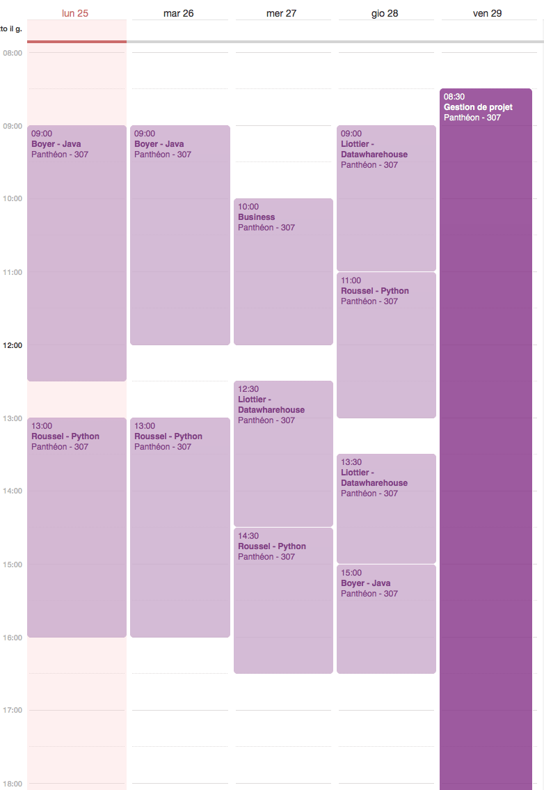

# Agenda

Équipe projet:

* Imane Nedjima Dahmani
* Li Deng
* Daniele Pitrolo
* Patrick Rivera

## Description

L'application permet de créer, modifier et afficher un agenda.

### Caractéristiques

* Multi-utilisateur: au démarrage on demande avec quel utilisateur on veut accéder
* Possibilité d'ajouter un évènement
* Possibilité de modifier un évènement
* Composition d'un évènement
   * nom
   * lieu
   * participants
   * début et fin (possibilité de couvrir plusieurs jours à étudier)
   * Remarques pour l'évènement (cf. RFC 5545)

* Une ou plusieurs personnes peuvent être associées à l'évènement (Fiche personne en vcard)
 * Avant de fermer la session le programme montre une liste des personnes à prévenir. Les personnes à prévenir sont celles présentes dans des évènements créés ou bien modifiés.

#### Export

  * export d'un calendrier
  * export d'un seul évènement

### Base de données

La base de données stocke

* les personnes
* les utilisateurs
* les évènements

### Fonctionnement de l'interface graphique

#### Les éléments de l'interface:

* Affichage des évènements
* Un bouton pour créer un nouvel évènement
* Un bouton pour créer un nouveau calendrier
* Un bouton pour faire un export
* Un bouton pour fire un import

#### Fonctionnement de l'interface:

Evènement:

* Un double clic sur l'évènement ouvre une fenêtre qui en montre les détails.
  * Un bouton permet de passer en mode *Modification*, un bouton permet de supprimer l'évènement

### Prolongements envisagés

* Envoi de courriels
